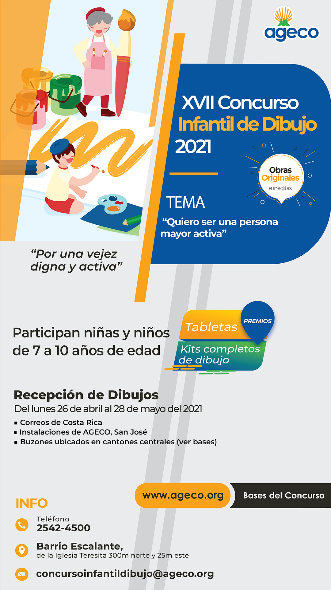

¡Niñas y niños entre 7 y 10 años pueden participar en este concurso!

<!--more-->

El tema de este año es “Quiero ser una persona mayor activa”.

Consultar las bases en este enlace: https://bit.ly/3x2S5Xp

Más información: 2542-4500 o al correo: concursoinfantildibujo@ageco.org

📌 Fecha límite de recepción de obras: 28 de mayo, 2021

