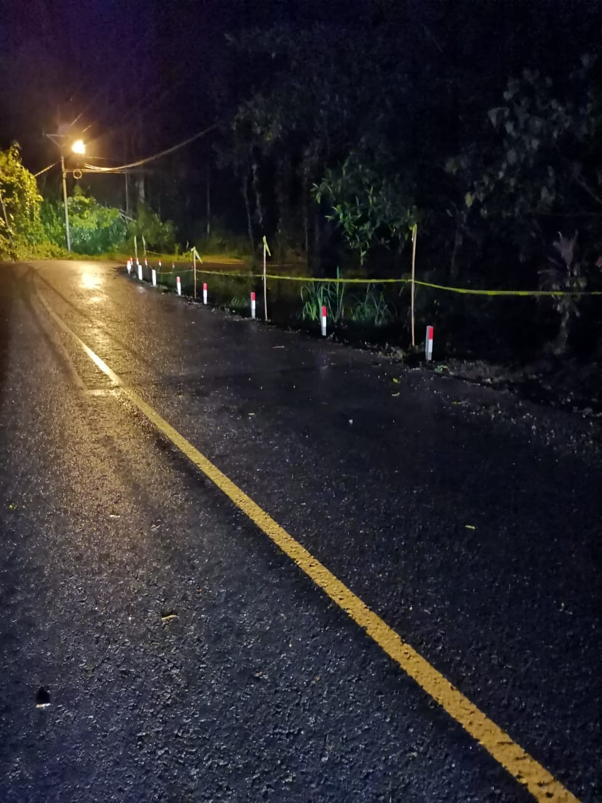

Colocación de señales preventivas en el tramo de los ZANJONES, puntualmente para tema visual, no de soporte, ya se le hizo un informe a Ingeniería de Tránsito para que valore colocar barandas flexbin.

