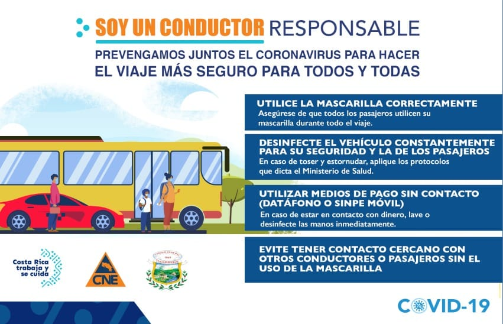

Prevengamos juntos el coronavirus para hacer el viaje más seguro para todoso y todas.
<!--more-->
* Utilice la mascarilla correctamente
* Desinfecte el vehículo constantemente para su seguridad y la de los pasajeros
* Utilizar medios de pago sin contacto (Datáfono o sinpe móvil)
* Evite tener contacto cercano con otros conductores o pasajeros sin el uso de mascarilla

