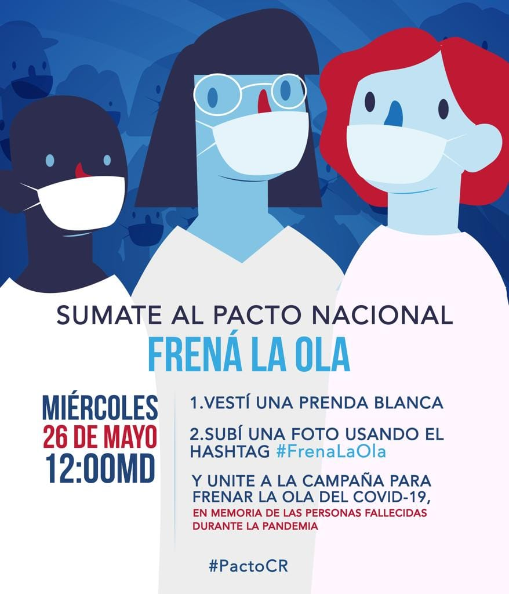

Bajo el lema **“Frená la Ola”**, este miércoles 26 de mayo a las 12 mediodía, sectores invitan a todas las personas a sumarse a un **Pacto Nacional** que busca unir al país y vestirlo de blanco para frenar el contagio por la COVID-19.

Es una acción simbólica que busca incentivar el compromiso a **no bajar la guardia y extremar las medidas de seguridad para frenar la curva de contagio** de este virus. 

Por tal razón, quisiera pedirles que sus instituciones se unan y repliquen el llamado.

Adjunto comunicado y un link con una guía de mensajes con el cronograma de salida, el cual, a través de una nomenclatura específica, vincula con las carpetas de materiales necesarios. 

Enlace: [https://j.mp/34atsuO](https://j.mp/34atsuO)

