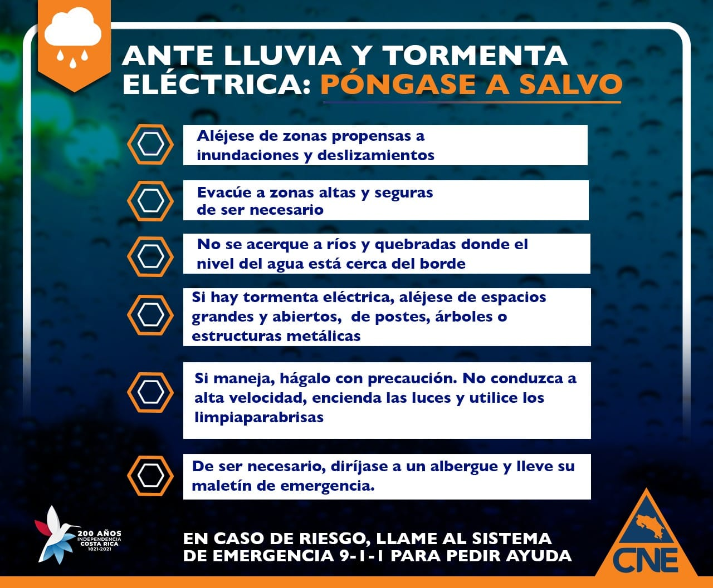

Se le recuerda a la población, principalmente, a la que habita en zonas de riesgo mantenerse informada y acatar solamente los mensajes que se difundan las instancias oficiales en el nivel nacional, regional y municipal.

<!--more-->

Ante lluvia y tormenta eléctrica: Póngase a salvo

* Aléjese de zonas propensas a inundaciones y deslizamientos
* Evacúe a zonas altas y seguras si es necesario
* No se acerque a ríos y quebradas donde el nivel del agua está cerca del borde
* Si hay tormenta eléctrica, aléjese de espacio grandes y abiertos, de postes, árboles o estructuras metálicas
* Si maneja, hágalo con precaución. No conduzca a alta velocidad, encienda las luces y utilice los limpiaparabrisas
* De ser necesaio, diríjase a un albergue y lleve su maletín de emergencia

En caso de riesgo, llame al sistema de emergencia 9-1-1 para pedir ayuda

