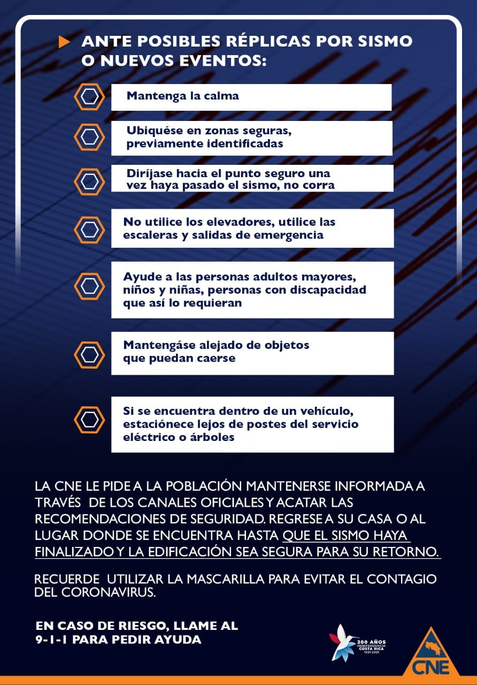

Ante posibles réplicas por sismo o nuevos eventos:

* Mantenga la calma
* Ubíquese en zonas seguras, previamente identificadas
* Diríjase hacia el punto seguro una vez haya pasado el sismo, no corra
* No utilice los elevadores, utilice las escaleras y salidas de emergencia
* Ayuda a las personas adultos mayores, niños y niñas, personas con discapacidad que así lo requieran
* Manténgase alejado de objetos que puedan caerse
* Si se encuentra dentro de un vehículo, estaciónese lejos de postes del servicio eléctrico o árboles

La CNE le pide a la población mantenerse informada a través de los canales oficiales y acatar las recomendaciones de seguridad. Regrese a su casa o al lugar donde se encuentra hasta que el sismo haya finalizado y la edificación sea segura para su retorno.

Recuerde utilizar la mascarailla para evitar el contagio del coronavirus.

En caso de riesgo, llame el 9-1-1 para pedir ayuda

