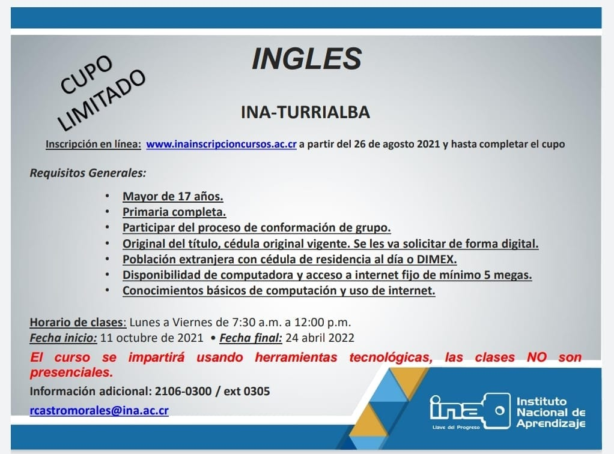

INA-Turrialba los invita a formar parte del curso de inglés que se impartirá de forma virtual a partir de este 11 de octubre.

<!--more-->

# Cupo Limitado

_Inscripción en línea_: [inainscripcioncursos.ac.cr/WebForms/Default.aspx](https://www.inainscripcioncursos.ac.cr/WebForms/Default.aspx) a partir del 26 de agosto 2021 y hasta completar el cupo
_Horario de clases_: De lunes a viernes de 7:30am a 12:00md
_Fecha de inicio_: 11 de octubre de 2021
_Fecha de finalización_: 24 de abril de 2021
_Información adicional_: [2106-0300](tel:21060300) ext 0305 o [rcastromorales@ina.ac.cr](mailto:rcastromorales@ina.ac.cr) 

### Requisitos Generales

* Mayor de 17 años
* Primaria completa
* Participar del proceso de conformación de grupo
* Original del título, cédula original vigente (se les va solicitar de forma digital)
* Población extranjera con cédula de residencial al día o DIMEX
* Disponibilidad de computadora y acceso a internet fijo de mínimo 5 Mbps
* Conocimientos básicos de computación y uso de internet

*El curso de impartirá usando herramientas tecnológicas, las clases no son presenciales*

