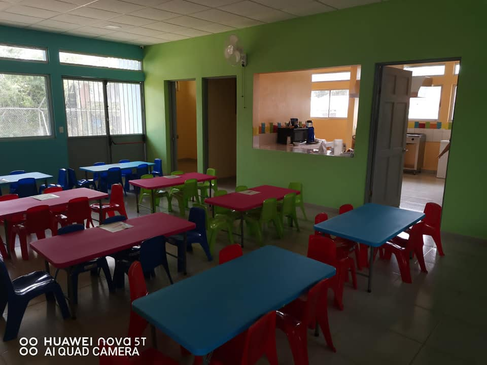

Que mejor actividad para celebrar el día de los niños y niñas. El día de hoy se firmó la entrega oficial del nuevo edificio del CEN-CINAI de Tucurrique ubicado en la Comunidad de San Pancracio. La inversión de está obra fue de un costo aproximado a los 180.000.000 de colones. 

<!--more-->

Para nosotros como gobierno local es de gran satisfacción el poder invertir recursos económicos en la niñez, sobre todo con el Ministerio de Salud, Departamento de CEN-CINAI que ya tiene una trayectoria de más de 70 años en favor de nuestros niños, donde no sólo es alimentación si no también salud, educación, recreación, cultivo de hortalizas y bienestar toda la familia.

Aclaramos que el actual CEN-CINAI se mantiene operando cómo lo ha hecho por más de 50 años que el nuevo es una opción de crecimiento, sobre todo para el lado Este de Tucurrique Centro lo que genera más y mejor acceso a los pueblos como el Colegio, San Pancracio, la Flora, Chucullo e incluso Las Vueltas, donde ya se habla de posible transporte para los chicos y adicional generará aproximadamente 5 empleos en educación, limpieza, cocina entre otros, si aclaramos que CEN-CINAI es la encargada del 100% tema administrativo.

