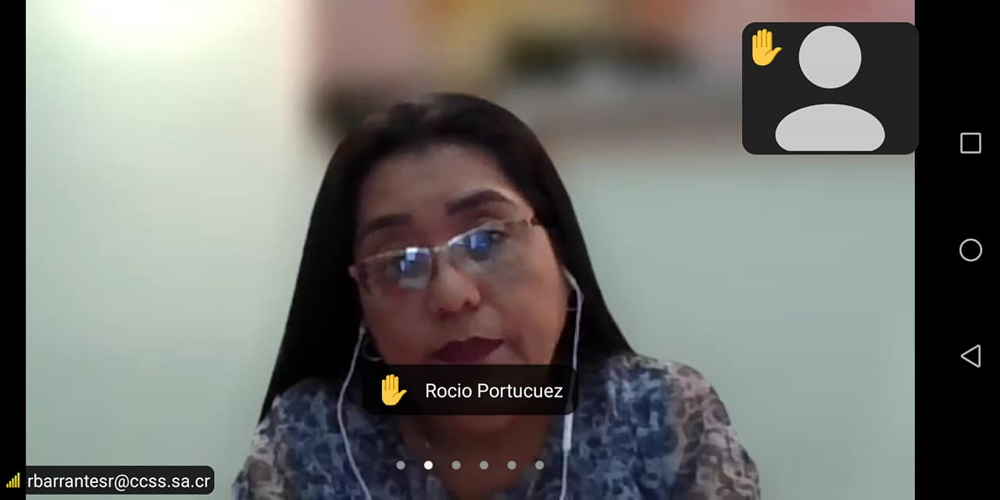
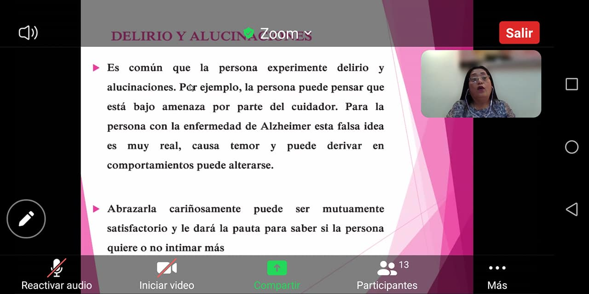
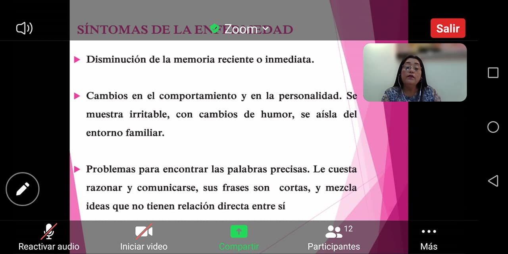
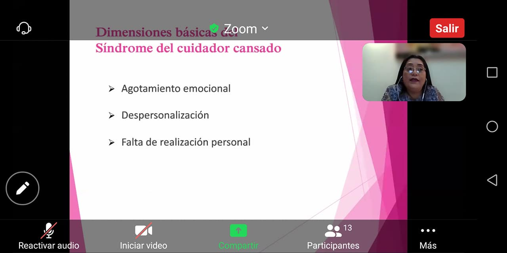
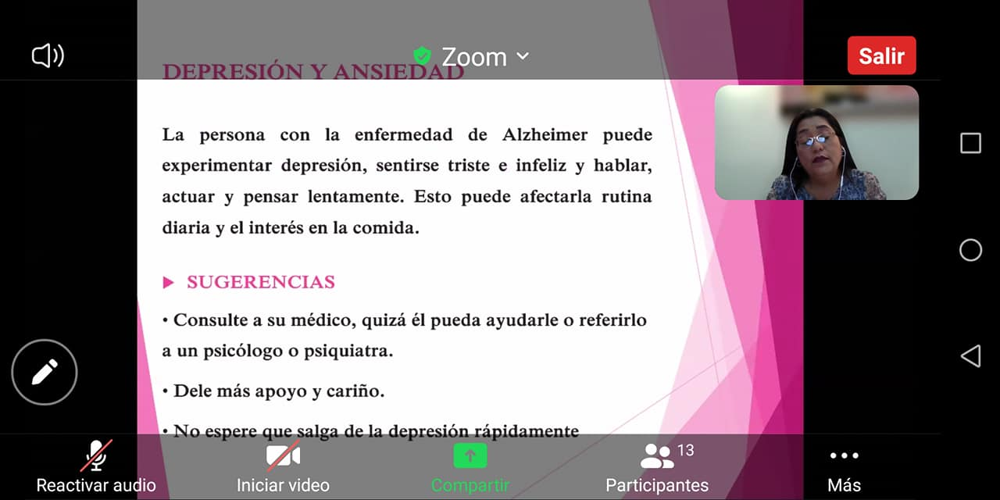
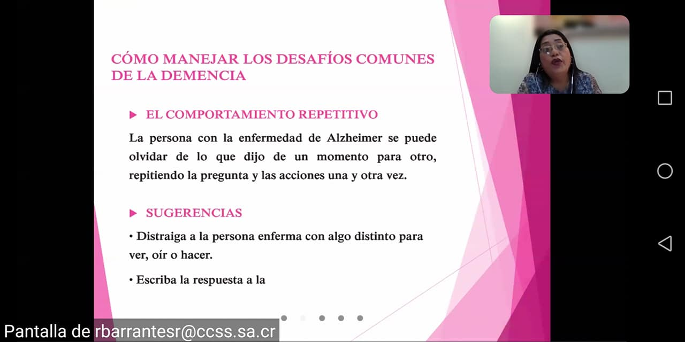
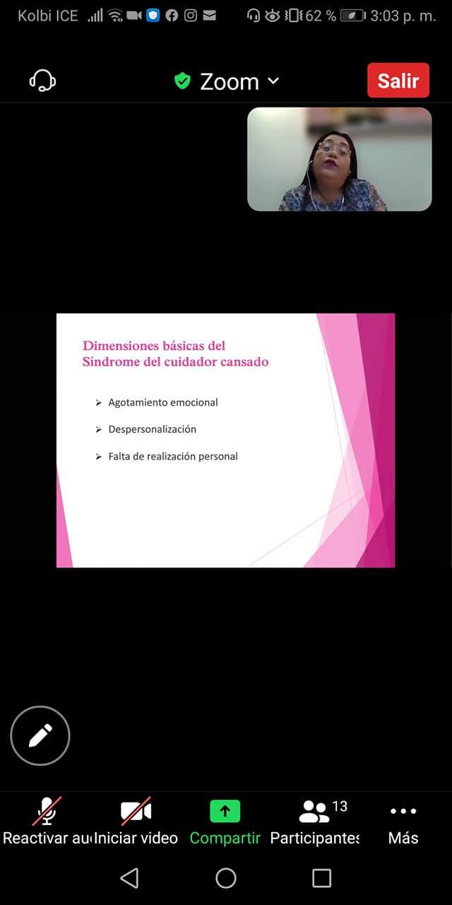
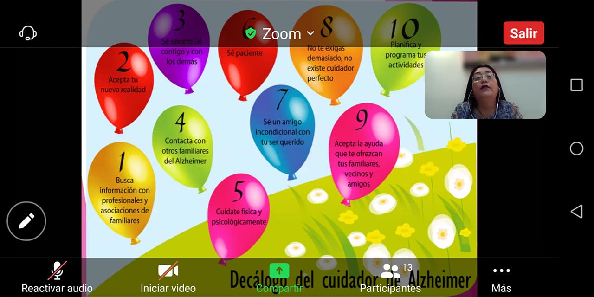

Gracias a la coordinación con el Área de Cuidado de Oro de la Caja Costarricense de Seguro Social, el día de hoy dió inicio el Taller para familiares y cuidadores de personas con Alzheimer 
<!--more-->

La duración de este taller es de 4 jueves y brindará a las familias orientación en el cuido de su ser querido que padece este tipo de demencia.

